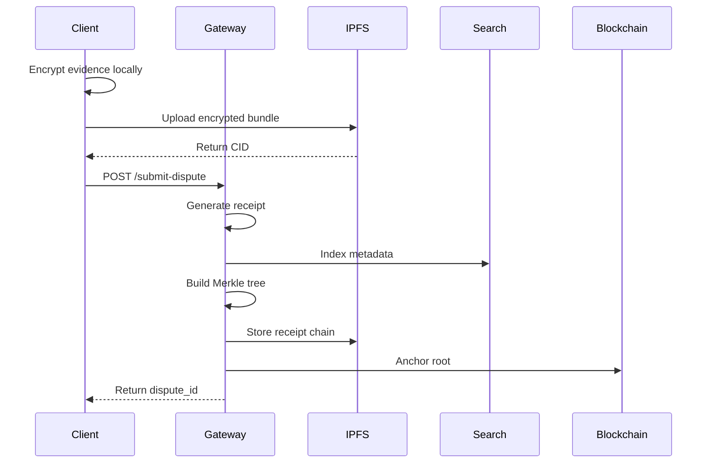
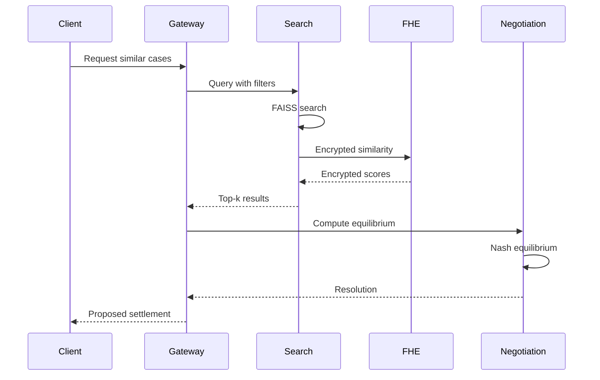

# DALRN - Detailed Product Requirements Document
**Version:** 1.0  
**Date:** September 11, 2025  
**Status:** Draft

---

## Executive Summary

DALRN (Distributed Adaptive Learning & Resolution Network) is a blockchain-based platform for secure, automated resolution of legal disputes using advanced AI and cryptographic techniques. The system provides verifiable, privacy-preserving dispute resolution through a combination of homomorphic encryption, game-theoretic negotiation, and federated learning.

---

## 1. Product Vision & Goals

### 1.1 Vision Statement
Create a trustless, automated dispute resolution system that preserves privacy while providing cryptographically verifiable outcomes, reducing legal costs and resolution time by orders of magnitude.

### 1.2 Strategic Goals
- **Efficiency**: Reduce dispute resolution time from months to days
- **Privacy**: Process disputes without exposing sensitive information
- **Verifiability**: Provide cryptographic proof of every processing step
- **Fairness**: Use game theory to ensure equitable outcomes
- **Scalability**: Handle 100,000+ disputes per day

### 1.3 Success Criteria
- 95% reduction in resolution time vs traditional arbitration
- Zero plaintext exposure of dispute evidence
- 100% cryptographic verification of processing steps
- Nash equilibrium-based fair outcomes
- Sub-second ingestion latency at scale

---

## 2. System Architecture

### 2.1 Core Components

#### 2.1.1 Self-Organizing Agent Networks
- **Purpose**: Dynamic task allocation and load balancing
- **Technology**: Graph Neural Networks with Watts-Strogatz topology
- **Specifications**:
  - Network size: 100 nodes
  - Connectivity: k=6 connections per node
  - Rewiring probability: p=0.1
  - Latency SLO: p95 < 5 seconds

#### 2.1.2 Homomorphic Legal Processing
- **Purpose**: Process encrypted dispute data without decryption
- **Technology**: CKKS homomorphic encryption via TenSEAL
- **Specifications**:
  - Security level: 128-bit
  - Polynomial modulus: 8192
  - Scale: 2^40
  - Error tolerance: <10%

#### 2.1.3 Quantum-Inspired Search
- **Purpose**: Efficient precedent matching in encrypted space
- **Technology**: FAISS HNSW with Grover-style reweighting
- **Specifications**:
  - Vector dimensions: 384 (MiniLM) or 768 (BERT)
  - Candidate pool: K=1024
  - Similarity threshold: τ=0.8
  - Target recall@10: ≥95%

#### 2.1.4 Federated Learning System
- **Purpose**: Cross-firm model training without data sharing
- **Technology**: Flower/NV FLARE with differential privacy
- **Specifications**:
  - Privacy budget: ε=4.0 per tenant
  - Aggregation: Secure aggregation with masking
  - Robustness: Median/trimmed mean options

#### 2.1.5 Adversarial Negotiation Engine
- **Purpose**: Game-theoretic dispute resolution
- **Technology**: Nash equilibrium computation via nashpy
- **Specifications**:
  - Algorithm: Lemke-Howson enumeration
  - Selection rules: Nash Social Welfare, Egalitarian
  - BATNA support: Configurable reservation values

---

## 3. Functional Requirements

### 3.1 Gateway Service (FR-GW)

#### FR-GW-001: Dispute Submission
**Endpoint**: `POST /submit-dispute`  
**Input**:
```json
{
  "parties": ["party_A_id", "party_B_id"],
  "jurisdiction": "US-NY",
  "cid": "QmHash...",  // IPFS hash of encrypted evidence
  "enc_meta": {
    "encryption_scheme": "CKKS",
    "key_id": "client_key_123"
  }
}
```
**Output**:
```json
{
  "dispute_id": "disp_abc123",
  "status": "INTAKE_COMPLETE",
  "anchor_tx": "0x...",
  "receipt_cid": "QmReceipt..."
}
```
**Acceptance Criteria**:
- Generate unique dispute ID
- Create PoDP receipt for intake
- Build Merkle tree of receipts
- Anchor root on blockchain
- Return within 1 second

#### FR-GW-002: Status Tracking
**Endpoint**: `GET /status/{dispute_id}`  
**Output**:
```json
{
  "dispute_id": "disp_abc123",
  "phase": "NEGOTIATION",
  "receipts": [
    {
      "step": "INTAKE_V1",
      "timestamp": "2025-09-11T10:00:00Z",
      "merkle_proof": ["0x..."]
    }
  ],
  "anchor_txs": ["0x..."],
  "epsilon_budget": {
    "allocated": 4.0,
    "spent": 2.3,
    "remaining": 1.7
  }
}
```

#### FR-GW-003: Evidence Addition
**Endpoint**: `POST /evidence`  
**Input**:
```json
{
  "dispute_id": "disp_abc123",
  "cid": "QmNewEvidence...",
  "type": "supplemental"
}
```

### 3.2 Search Service (FR-SR)

#### FR-SR-001: Vector Index Building
**Endpoint**: `POST /search/build`  
**Process**:
1. Accept embeddings (plaintext for MVP, encrypted later)
2. Normalize to unit vectors
3. Build FAISS HNSW index (M=32, efConstruction=100)
4. Generate PoDP receipt

#### FR-SR-002: Similarity Search
**Endpoint**: `POST /search/query`  
**Input**:
```json
{
  "dispute_id": "disp_abc123",
  "query_vec": [0.1, 0.2, ...],  // 768-dim
  "k": 10,
  "reweight_iters": 0  // 0=disabled, 6=quantum-inspired
}
```
**Output**:
```json
{
  "results": [
    {"doc_id": "doc_001", "score": 0.95},
    {"doc_id": "doc_002", "score": 0.92}
  ],
  "receipt_id": "r_search_123",
  "latency_ms": 423
}
```
**Performance Requirements**:
- Recall@10 ≥ 95% vs exhaustive search
- P95 latency < 600ms for 10k corpus
- P99 latency < 1000ms

#### FR-SR-003: A/B Testing Support
**Feature**: Reweighting flag for gradual rollout
**Implementation**:
- Default: reweight_iters=0 (standard FAISS)
- Experimental: reweight_iters=6 (quantum-inspired)
- Metrics collection for comparison

### 3.3 FHE Service (FR-FHE)

#### FR-FHE-001: Encrypted Dot Product
**Endpoint**: `POST /fhe/dot`  
**Input**:
```json
{
  "tenant_id": "firm_A",
  "enc_query": "base64_ciphertext...",
  "enc_vectors": ["base64_cipher1...", "base64_cipher2..."]
}
```
**Output**:
```json
{
  "enc_scores": ["base64_result1...", "base64_result2..."],
  "computation_id": "comp_123",
  "receipt_id": "r_fhe_456"
}
```
**Requirements**:
- Single CKKS context per tenant
- Client-side decryption only
- Batch processing for efficiency
- Error rate < 10% vs plaintext

#### FR-FHE-002: Context Management
**Process**:
1. Initialize CKKS context per tenant
2. Store evaluation keys securely
3. Rotate contexts based on noise budget
4. Generate receipts for all operations

### 3.4 Negotiation Service (FR-NEG)

#### FR-NEG-001: Nash Equilibrium Computation
**Endpoint**: `POST /negotiate`  
**Input**:
```json
{
  "payoff_matrix_A": [[3,0], [5,1]],
  "payoff_matrix_B": [[3,5], [0,1]],
  "selection_rule": "nsw",  // nash_social_welfare
  "batna": [2.0, 2.0]  // reservation values
}
```
**Output**:
```json
{
  "equilibrium": {
    "strategy_row": [0.5, 0.5],
    "strategy_col": [0.6, 0.4],
    "payoff_A": 2.4,
    "payoff_B": 2.2
  },
  "explanation_cid": "QmExplanation...",
  "receipt_id": "r_neg_789"
}
```

#### FR-NEG-002: Explanation Generation
**Requirements**:
- Generate human-readable explanation memo
- Include causal influence diagram (CID)
- Store in IPFS with CID reference
- Deterministic for reproducibility

#### FR-NEG-003: Multiple Equilibria Handling
**Process**:
1. Enumerate all Nash equilibria (Lemke-Howson)
2. Apply selection rule (NSW or egalitarian)
3. Break ties deterministically
4. Document selection reasoning

### 3.5 Federated Learning Service (FR-FL)

#### FR-FL-001: Privacy Budget Management
**Endpoint**: `POST /fl/precheck`  
**Input**:
```json
{
  "tenant_id": "firm_A",
  "model_id": "dispute_classifier_v2",
  "requested_epsilon": 0.5
}
```
**Output**:
```json
{
  "allowed": true,
  "remaining_budget": 3.5,
  "total_budget": 4.0
}
```

#### FR-FL-002: Federated Round Orchestration
**Process**:
1. Check privacy budgets for all participants
2. Distribute model to clients
3. Collect encrypted gradients
4. Apply secure aggregation
5. Update global model
6. Commit epsilon to ledger

#### FR-FL-003: Robust Aggregation
**Options**:
- Mean (standard)
- Median (Byzantine-robust)
- Trimmed mean (outlier-resistant)
- Krum (adversarial-robust)

### 3.6 Blockchain Service (FR-BC)

#### FR-BC-001: Receipt Anchoring
**Contract**: `AnchorReceipts.sol`  
**Function**: `anchorRoot()`  
**Parameters**:
- disputeId: bytes32
- merkleRoot: bytes32
- modelHash: bytes32
- round: uint256
- uri: string (IPFS)
- tags: bytes32[]

#### FR-BC-002: Event Emission
**Events**:
- `RootAnchored`: Merkle root committed
- `ReceiptAnchored`: Individual receipt stored
**Requirements**:
- Indexed by disputeId for efficient queries
- Include block number for temporal ordering

---

## 4. Non-Functional Requirements

### 4.1 Performance (NFR-P)

#### NFR-P-001: Latency Requirements
- Dispute ingestion: < 1 second
- Status query: < 100ms
- Search (10k docs): P95 < 600ms
- FHE dot product: < 30 seconds
- Negotiation: < 5 seconds
- End-to-end: < 2 minutes

#### NFR-P-002: Throughput Requirements
- Concurrent disputes: 1,000
- Daily dispute volume: 100,000
- Search QPS: 100
- FHE operations/sec: 10

#### NFR-P-003: Scalability Requirements
- Horizontal scaling for all services
- Auto-scaling based on load
- Graceful degradation under overload

### 4.2 Security (NFR-S)

#### NFR-S-001: Encryption Requirements
- All evidence encrypted client-side
- CKKS with 128-bit security
- No plaintext in logs or storage
- Key rotation every 30 days

#### NFR-S-002: Access Control
- JWT-based authentication
- Role-based authorization
- Tenant isolation
- Rate limiting per client

#### NFR-S-003: Audit Requirements
- All operations generate receipts
- Receipts form Merkle trees
- Roots anchored on blockchain
- Complete audit trail

### 4.3 Privacy (NFR-PR)

#### NFR-PR-001: Differential Privacy
- Global privacy budget: ε=4.0
- Per-query budget: ε≤0.5
- Rényi DP accounting
- Budget enforcement

#### NFR-PR-002: Data Minimization
- No unnecessary data collection
- Automatic data expiration
- Right to deletion support
- Crypto-shredding capability

### 4.4 Reliability (NFR-R)

#### NFR-R-001: Availability
- System uptime: 99.9%
- Service SLA: 99.5%
- Graceful failure handling
- Circuit breakers

#### NFR-R-002: Data Integrity
- Canonical JSON serialization
- Deterministic Merkle trees
- Reproducible computations
- Checksums for all data

### 4.5 Compliance (NFR-C)

#### NFR-C-001: Regulatory
- GDPR compliance
- CCPA compliance
- SOC 2 Type II
- ISO 27001

#### NFR-C-002: Legal
- Admissible evidence trail
- Non-repudiation via signatures
- Timestamp accuracy
- Jurisdiction awareness

---

## 5. Data Models

### 5.1 Dispute Model
```typescript
interface Dispute {
  id: string;                    // disp_abc123
  parties: Party[];              // Involved parties
  jurisdiction: string;          // Legal jurisdiction
  evidence: Evidence[];          // Encrypted documents
  status: DisputeStatus;        // Current phase
  receipts: Receipt[];          // PoDP trail
  resolution?: Resolution;      // Final outcome
  created_at: timestamp;
  updated_at: timestamp;
}
```

### 5.2 Receipt Model
```typescript
interface Receipt {
  receipt_id: string;           // Unique ID
  dispute_id: string;           // Parent dispute
  step: string;                 // Processing step
  inputs: object;               // Input hashes
  params: object;               // Parameters used
  artifacts: object;            // Output references
  hashes: {
    inputs_hash: string;        // Keccak256
    outputs_hash: string;       // Keccak256
  };
  signatures: string[];         // Digital signatures
  timestamp: string;            // ISO 8601
}
```

### 5.3 Privacy Ledger Entry
```typescript
interface EpsilonEntry {
  tenant_id: string;
  model_id: string;
  round: number;
  epsilon: number;              // Privacy cost
  delta: number;                // Failure probability
  mechanism: string;            // DP mechanism used
  timestamp: string;
}
```

---

## 6. User Flows

### 6.1 Dispute Submission Flow


### 6.2 Search and Negotiation Flow


---

## 7. API Specifications

### 7.1 RESTful APIs

#### Gateway API
```yaml
openapi: 3.0.0
paths:
  /submit-dispute:
    post:
      summary: Submit new dispute
      requestBody:
        required: true
        content:
          application/json:
            schema:
              $ref: '#/components/schemas/DisputeSubmission'
      responses:
        '201':
          description: Dispute created
          content:
            application/json:
              schema:
                $ref: '#/components/schemas/DisputeResponse'
                
  /status/{dispute_id}:
    get:
      summary: Get dispute status
      parameters:
        - name: dispute_id
          in: path
          required: true
          schema:
            type: string
      responses:
        '200':
          description: Status retrieved
          content:
            application/json:
              schema:
                $ref: '#/components/schemas/StatusResponse'
```

### 7.2 gRPC Services

#### Search Service
```protobuf
syntax = "proto3";

service SearchService {
  rpc BuildIndex(BuildRequest) returns (BuildResponse);
  rpc Query(QueryRequest) returns (QueryResponse);
}

message QueryRequest {
  string dispute_id = 1;
  repeated float query_vector = 2;
  int32 k = 3;
  int32 reweight_iters = 4;
}

message QueryResponse {
  repeated SearchResult results = 1;
  string receipt_id = 2;
  int64 latency_ms = 3;
}

message SearchResult {
  string doc_id = 1;
  float score = 2;
}
```

---

## 8. Testing Requirements

### 8.1 Unit Testing
- Coverage target: 80%
- All services must have unit tests
- Mock external dependencies
- Test error conditions

### 8.2 Integration Testing
- End-to-end dispute flow
- Service interaction tests
- Database integration
- Blockchain integration

### 8.3 Performance Testing
- Load testing: 1000 concurrent users
- Stress testing: Find breaking point
- Latency benchmarks
- Memory leak detection

### 8.4 Security Testing
- Penetration testing
- Encryption validation
- Access control testing
- Input validation

---

## 9. Deployment & Operations

### 9.1 Infrastructure
```yaml
Production:
  Compute:
    - Service: AWS EKS / GKE
    - Instances: GPU-enabled for ML
    - Auto-scaling: Based on CPU/memory
  Storage:
    - Primary: PostgreSQL (RDS)
    - Cache: Redis
    - Files: IPFS cluster
  Network:
    - CDN: CloudFront
    - Load Balancer: ALB
    - Service Mesh: Istio
```

### 9.2 Monitoring
- **Metrics**: Prometheus + Grafana
- **Logs**: ELK stack
- **Traces**: Jaeger
- **Alerts**: PagerDuty

### 9.3 CI/CD Pipeline
```yaml
Pipeline:
  - Source: GitHub
  - CI: GitHub Actions
  - Testing: Automated test suites
  - Security: Snyk scanning
  - Deployment: ArgoCD
  - Rollback: Automatic on failure
```

---

## 10. Acceptance Criteria

### 10.1 MVP Acceptance
- [ ] End-to-end dispute flow working
- [ ] All services emit PoDP receipts
- [ ] Receipts anchored on blockchain
- [ ] Search recall@10 > 95%
- [ ] FHE parity within 10%
- [ ] Nash equilibrium computed correctly
- [ ] Privacy budget tracked
- [ ] Status UI functional

### 10.2 Production Acceptance
- [ ] 100k disputes/day capacity
- [ ] P95 latency < SLA
- [ ] 99.9% uptime achieved
- [ ] Security audit passed
- [ ] Compliance certified
- [ ] Documentation complete
- [ ] Team trained

---

## 11. Edge Cases & Error Handling

### 11.1 Edge Cases
- Empty dispute submission
- Duplicate evidence
- No Nash equilibrium exists
- Privacy budget exhausted
- Blockchain congestion
- IPFS unavailable
- Client key loss

### 11.2 Error Handling
```typescript
enum ErrorCode {
  INVALID_INPUT = 400,
  UNAUTHORIZED = 401,
  BUDGET_EXCEEDED = 403,
  NOT_FOUND = 404,
  CONFLICT = 409,
  INTERNAL_ERROR = 500,
  SERVICE_UNAVAILABLE = 503
}

interface Error {
  code: ErrorCode;
  message: string;
  details?: object;
  trace_id: string;
}
```

---

## 12. Dependencies & Risks

### 12.1 Technical Dependencies
- TenSEAL library stability
- FAISS GPU support
- Blockchain gas costs
- IPFS availability
- Network latency

### 12.2 Risks & Mitigations
| Risk | Impact | Probability | Mitigation |
|------|--------|-------------|------------|
| FHE too slow | High | Medium | Batch processing, caching |
| Privacy budget exceeded | High | Low | Strict enforcement, alerts |
| Blockchain congestion | Medium | Medium | L2 solutions, batching |
| IPFS downtime | Medium | Low | Redundant nodes, fallback |
| Key compromise | High | Low | HSM, key rotation |

---

## 13. Timeline & Milestones

### Phase 1: Foundation (Weeks 1-2)
- Core service implementation
- PoDP instrumentation
- Basic UI

### Phase 2: Integration (Weeks 3-4)
- Service orchestration
- Blockchain anchoring
- End-to-end testing

### Phase 3: Privacy & ML (Weeks 5-6)
- ε-ledger implementation
- Federated learning
- Differential privacy

### Phase 4: Hardening (Weeks 7-8)
- Performance optimization
- Security hardening
- Production deployment

---

## 14. Appendices

### A. Glossary
- **DALRN**: Distributed Adaptive Learning & Resolution Network
- **PoDP**: Proof of Data Processing
- **CKKS**: Cheon-Kim-Kim-Song encryption scheme
- **BATNA**: Best Alternative to Negotiated Agreement
- **Nash Equilibrium**: Game theory solution concept
- **ε-ledger**: Epsilon (privacy) budget ledger

### B. References
- CKKS Paper: https://eprint.iacr.org/2016/421
- FAISS Documentation: https://github.com/facebookresearch/faiss
- Nash Equilibrium: https://en.wikipedia.org/wiki/Nash_equilibrium
- Differential Privacy: https://privacytools.seas.harvard.edu/

### C. Version History
| Version | Date | Author | Changes |
|---------|------|--------|---------|
| 1.0 | 2025-09-11 | System | Initial detailed PRD |

---

*This document represents the complete functional and technical requirements for the DALRN system, derived from the Research DALRN specifications and existing implementation plan.*